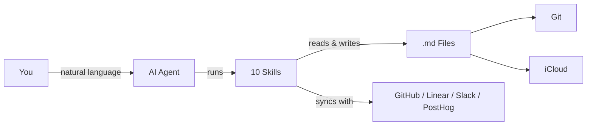
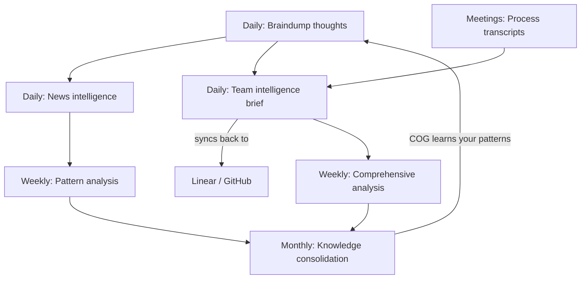

# COG: The Agentic Second Brain That Actually Self-Evolves

**Cognition + Obsidian + Git** — A self-evolving second brain powered by AI agents, markdown files, and version control. No database, no vendor lock-in — just `.md` files that think.

[Quick Start](#quick-start) | [Skills](#skills) | [Features](#features-at-a-glance) | [FAQ](#faq) | [SETUP.md](SETUP.md)

> Works with [Claude Code](https://claude.ai/download) • [Kiro](https://kiro.dev/) • [Gemini CLI](https://github.com/google-gemini/gemini-cli) • [OpenAI Codex](https://github.com/openai/codex) • any AI that reads markdown



> **New to COG?** Watch the [2-minute walkthrough](https://youtube.com/PLACEHOLDER) to see it in action.

## Quick Start

**1. Clone & enter the repo:**
```bash
git clone https://github.com/huytieu/COG-second-brain.git
cd COG-second-brain
```

**2. Run onboarding in your agent:**

| Agent | Command | How it finds skills |
|---|---|---|
| Claude Code | `code .` → "Run onboarding" | `.claude/skills/` |
| Kiro | Open folder → "setup COG" | `.kiro/powers/` |
| Gemini CLI | `gemini` → `/onboarding` | `GEMINI.md` + `.gemini/commands/` |
| OpenAI Codex | `codex` → "Run onboarding" | `AGENTS.md` |
| Other agents | Point at `AGENTS.md` → "Run onboarding" | `AGENTS.md` |

Done — COG is personalized and ready in ~2 minutes. See [SETUP.md](SETUP.md) for optional config (Git sync, iCloud, Obsidian Tasks, etc.).

## Skills

### Core Skills (Personal Knowledge)

| Skill | What it does | Try saying... |
|---|---|---|
| **onboarding** | Personalize COG for your workflow (run first!) | "Run onboarding" |
| **braindump** | Capture raw thoughts with intelligent classification | "I need to braindump" |
| **daily-brief** | Verified news intelligence (7-day freshness) | "Give me my daily brief" |
| **url-dump** | Save URLs with auto-extracted insights | "Save this URL" |
| **weekly-checkin** | Cross-domain pattern analysis | "Weekly review" |
| **knowledge-consolidation** | Build frameworks from scattered notes | "Consolidate my knowledge" |
| **update-cog** | Update framework files without touching your content | "Update COG" |

### Team Intelligence Skills (for Product & Engineering Leads)

| Skill | What it does | Try saying... |
|---|---|---|
| **team-brief** | Cross-reference GitHub + Linear + Slack + PostHog into a daily team intelligence brief with two-way Linear sync-back | "Team brief" / "What did we ship?" |
| **meeting-transcript** | Process meeting recordings into structured decisions, action items, and team dynamics | "Process this meeting" |
| **comprehensive-analysis** | Deep 7-day analysis for weekly reviews, board prep, or strategic planning (~8-12 min) | "Weekly analysis" / "Board prep" |

### Role Packs (Personalized Recommendations)

COG matches your role during onboarding to a **role pack** that prioritizes the most relevant skills and integrations for you. Available role packs: Product Manager, Engineering Lead, Engineer, Designer, Founder, Marketer — or create your own from the template.

> **New to team skills?** These require GitHub CLI (`gh`) and work best with Linear, Slack, and PostHog MCP integrations. They degrade gracefully — start with just GitHub and add integrations over time. See [SETUP.md](SETUP.md) for configuration.

## The Evolution Cycle



- **Daily capture** — braindump raw thoughts; COG classifies by domain and extracts action items
- **Daily intelligence** — personalized news briefings with verified, sourced news
- **Daily team brief** — cross-reference GitHub, Linear, Slack, PostHog, meetings into one brief with two-way sync
- **Meeting processing** — extract decisions, action items, and team dynamics from transcripts
- **Weekly reflection** — pattern analysis across all domains surfaces insights you'd miss
- **Weekly deep dive** — comprehensive analysis for board prep, retros, and strategic planning
- **Monthly synthesis** — scattered notes become consolidated frameworks and a knowledge base

## Features at a Glance

| | | |
|---|---|---|
| **Self-Evolving** — Learns your patterns, auto-organizes content, builds frameworks | **Self-Healing** — Rename files or restructure; cross-references update automatically | **Verification-First** — Sources required, 7-day freshness, confidence levels on all analysis |
| **Privacy-First** — Local `.md` files, strict domain separation, no external servers | **Multi-Device** — iCloud sync to iPhone/iPad/Mac; Git for version history | **Obsidian Tasks** — `📅 YYYY-MM-DD` emoji format works with Tasks plugin dashboards |

## Your Vault

```
COG-second-brain/
├── .claude/skills/          # Claude Code skills (10)
├── .claude/roles/           # Role packs (7) — personalized recommendations
├── .kiro/powers/            # Kiro powers
├── .gemini/commands/        # Gemini CLI commands
├── AGENTS.md                # Universal agent docs
├── CLAUDE.md                # Framework instructions
├── 00-inbox/                # Profiles, interests, integrations
├── 01-daily/                # Briefs & check-ins
├── 02-personal/             # Personal braindumps (private)
├── 03-professional/         # Professional braindumps & strategy
├── 04-projects/             # Per-project tracking
└── 05-knowledge/            # Consolidated insights & patterns
```

> **Real-world results:** 120+ braindumps processed, daily briefs with 95%+ source accuracy, 5 major strategic insights discovered — zero maintenance required.

## Keeping COG Updated

COG separates **framework files** (skills, docs, scripts) from **your content** (braindumps, profiles, notes). Updates never touch your personal data.

| Method | Command |
|---|---|
| AI Agent (any) | "Update COG" or `/update-cog` |
| Shell script | `./cog-update.sh` (interactive) • `--check` • `--dry-run` • `--force` |
| Manual Git | `git fetch cog-upstream main` then checkout specific files |

Check your version: `cat COG-VERSION`

## FAQ

<details><summary><strong>Why not just use Notion / Roam / Obsidian alone?</strong></summary>

COG adds self-evolving intelligence on top. It doesn't just store — it learns, analyzes, and synthesizes insights automatically.
</details>

<details><summary><strong>How much does it cost?</strong></summary>

COG is free and open-source (MIT). You only pay for your AI agent's API usage.
</details>

<details><summary><strong>Is my data private?</strong></summary>

Yes. Everything is local markdown files. The AI agent's API is only called when you invoke a skill. No data stored on external servers.
</details>

<details><summary><strong>Can I customize or add skills?</strong></summary>

Yes — edit any `SKILL.md` / `POWER.md` / `AGENTS.md` file. See [SETUP.md](SETUP.md) for details on creating new skills.
</details>

<details><summary><strong>Will updating overwrite my customizations?</strong></summary>

No. The update process detects customized files and lets you choose per-file: keep yours, use upstream, or backup + update. Nothing is overwritten without approval.
</details>

<details><summary><strong>What if I don't use Git?</strong></summary>

Git is optional but recommended for version history. COG works fine with just iCloud sync.
</details>

## Roadmap

- [x] ~~Gemini CLI + OpenAI Codex support~~ (shipped in v3.1)
- [x] ~~Upstream update system~~ (shipped in v3.2)
- [x] ~~Role packs & integration discovery~~ (shipped in v3.3)
- [ ] Web interface for knowledge graph visualization
- [ ] Mobile-first commands (optimized for Obsidian mobile)
- [ ] Team collaboration features (with privacy preservation)
- [ ] Integration with calendar/task management tools

## Contributing & Support

| | | |
|---|---|---|
| [Contribute](CONTRIBUTING.md) | [Report bugs](https://github.com/huytieu/COG-second-brain/issues) | [Discussions](https://github.com/huytieu/COG-second-brain/discussions) |
| [Sponsor on GitHub](https://github.com/sponsors/huytieu) | [Buy me a coffee](https://buymeacoffee.com/0xlight) | [MIT License](LICENSE) |

## Acknowledgments

Built with [Claude Code](https://claude.ai/code), [Kiro](https://kiro.dev/), [Gemini CLI](https://github.com/google-gemini/gemini-cli), [OpenAI Codex](https://github.com/openai/codex), and [Obsidian](https://obsidian.md/). Inspired by Zettelkasten, Building a Second Brain, and GTD.

## Star History

[](https://www.star-history.com/#huytieu/COG-second-brain&type=date&legend=top-left)

---

**TL;DR:** Clone, run onboarding, braindump daily. COG evolves with you — just `.md` files, any AI agent, zero maintenance.
